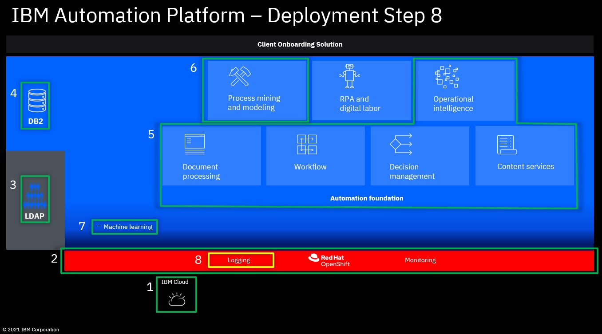

# Step 8: Optional: Setup OpenShift Logging Stack



## Introduction

The OpenShift Logging Stack provides a scalable enterprise ready mechanism to collect, manage and visualize logs across all services deployed in a Kubernetes cluster.  It enables better serviceability and operational visibility by allowing cluster administrators to easily query, parse and correlate logs collected from containers, nodes and the Kubernetes management plane itself.

The following set of instructions will provide a simplified way to setup the different components of the logging stack including the ElasticSearch and ClusterLogging operators, *Fluentd* for log collection, *ElasticSearch* for centralized recording of logs, *Kibana* for visualization and query of logs, and the *Curator* for log retention management.  For a more detailed explanation on this topic see [Introduction to the OpenShift 4 Logging Stack](https://www.openshift.com/blog/introduction-to-the-openshift-4-logging-stack).

## Pre-Requisites

- OpenShift cluster already deployed.
- User with cluster-admin role.
- OpenShift's `oc` command installed on system where script is going to run.
- The `sed` command installed on system where script is going to run.  

## Step 1: Modify default deployment parameters

As a simplified version of the deployment our scripts support a small subset of the Logging Stack configuration parameters. All these parameters can specified in the `logging/config.sh` script.  The table provided below describes the configuration parameters that can be changed using our scripts and the default values assigned to each setting.  Pay special attention to the `paramClusterLoggingStorageClass` since the default value is only valid on Managed OpenShift clusters deployed on the IBM Cloud (ROKS).

|Parameter|Description|Default|
|---------|-----------|-------|
|paramElasticSearchNodeCount|Number of Elasticsearch nodes. For high availability use at least 3 nodes.|3|
|paramClusterLoggingStorageClass|Name of the storage class used to persist logs. Notice that the default value is based on ROKS deployments.|ibmc-block-gold|
|paramFluentdBufferTotalLimitSize|The maximum size of the buffer, which is the total size of the stage and the queue.|8G|
|paramFluentDBufferFlushThreadCount|The number of threads that perform chunk flushing|4|

If all defaults are acceptable no changes have to be made before running the deployment script.  To modify any of the configuration parameters:

1. Open the `config.sh` file found under the `logging` directory and specify the new values.

## Step 2: Run Deployment Script

To deploy the Logging Stack on your OpenShift cluster:

1. Log in to the OpenShift cluster using the `oc loggin` command.
2. Run the `configure-logging.sh` command found under the `logging` directory and wait for completion.
3. If the following banner is displayed **all** Logging Stack components have been deployed successfully.

   ```bash
   *********************************************************************************
   *********             Logging Stack configured successfully!            *********
   *********             Please follow manual steps listed below           *********
   *********************************************************************************
   ```

**Note:** The `configure-logging.sh` script is idempotent and it is configured to stop immediately if an error is found during the deployment process. Should errors arise, you can re-run the script once the problems are corrected.

## Step 3: Configure Kibana

Once the Logging stack is installed, most of the components will be already configured except for Kibana.  When successfully completed, the `configure-logging.sh` script will provide a link to the Kibana instance that have just been installed.  Complete the configuration of Kibana as follows:

1. Go to the Kibana URL provided by the script.
2. If challenged with an authorization panel, keep the default permissions selected in the authorization panel and click the *Allow selected permissions* button.
3. Once in the Kibana UI, click on the *Create index pattern* button.
4. Enter `app-*` in the *Index pattern* field.
5. Click on the *Next step* button.
6. Select *@timestamp* from the *Time Filter field name*  drop down menu.
7. Click on the *Create index pattern* button below the drop down menu.
8. Repeat step 2-6 but use `infra-*` as the index pattern to create instead of `app-*`.

## Other Details

### Access to Kibana

Once Kibana is installed, the link to the Kibana console will be available under the Observabiliy section of the Openshift Management Console


### Resource files

During the deployment and configuration of the Openshift Logging stack we create a set of yaml files with the configuration for each of the resources created.  The files generated during the deployment are:

- `clo-instance.yaml`
- `clo-operatorgroup.yaml`
- `eo-namespace.yaml`
- `eo-subscription.yaml`
- `clo-namespace.yaml`
- `clo-subscription.yaml`
- `eo-operatorgroup.yaml`

All files are generated under the `logging` directory.  Save or keep these files under source control if you would like to keep track of resources deployed in your cluster.

### Configured Resources

At a high level the `configure-logging.sh` will configure the following resources into your Openshift cluster:

- Namespace `openshift-logging` 
- Namespace `openshift-operators-redhat`
- ElasticSearch and ClusterLogging operators from OpenShift's Operator Hub.
- ElasticSearch services. By default 3 Pods will be configured installed unless default configuration is changed.
- Fluentd services, one on each worker node.
- Curator services, single pod.
- Kibana services, single pod.

All resources are created through yaml files as input. The specific yaml files used for your cluster will be generated from `*.template.yaml` files under the `logging` directory.  The specific yaml files used for your cluster will be generated under that same directory. Keep these files for later use.

## What to do next

- If you want to enable the **monitoring infrastructure**, please complete as a next step **[Step 9: Optional: Setup OpenShift Monitoring Stack](09setupMonitoring.md)**
- Optionally, you can complete **[Step 10: Optional: Create new VSI for RPA & install IBM RPA](10createVMForRPA.md)**
- Optionally, you can complete **[Step 11: Optional: Scale up the deployment](11scaleUp.md)**
- **[Here](Readme.md)** you can get back to the overview page

Issues or questions? IBMers can use this IBM internal Slack channel: **#dba-swat-asset-qna** (**https://ibm-cloud.slack.com/archives/C026TD1SGCA**)

Everyone else can open a new issue in this github.
